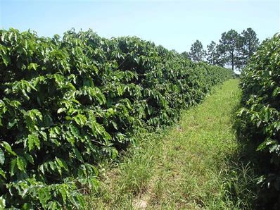
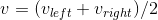
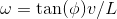
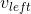
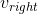

# Ransac Corridor Control #
ROS package `ransac_corridor_control` repository. This package approaches the problem of autonomous navigation of a platform through corridors of plantations based exclusively on the information provided by a laser sensor: the intra-row problem. But, it can be used in any navigation problem well-characterized by a corridor with some sort of stochastic walls. The problem of leaving one row and entering in the parallel one is not covered here.

* Example of rows of plantation:



## Installation
Just clone the repository into a ROS workspace and compile it with `catkin_make`.
* There are no dependencies others than the ones commonly required by ROS

### System Requirements ###
The master branch contains libraries that have been tested on Ubuntu 16.04.
To compile and use that branch, you must satisfy the following requirements:

* GCC version 5.4.1 or later
* CMake version 2.8.3 or later
* Git
* python 2.7

## Algorithms
The main algorithms used here are:
* A slightly modified version of the method Random Sample Consensus (RANSAC);
* An Extended Kalman Filter implementation;
* A PID control.

## Usage
The Ros package `ransac_corridor_control` can easily be initialized by the command:

```
roslaunch ransac_corridor_control full.launch
```

The command above will launch three nodes, which are called:
* bisector;
* filter;
* control.

### bisector node
This node subscribes to the topics:
* `\scan` of message type **sensor_msgs/LaserScan**.

It is from the topic `\scan` that the data from the corridor environment provided by a laser scan sensor are made available for the slightly modified version of the method RANSAC, which basically estimates support lines of the corridor's wall and a bisector line.

This node publishes to the topics:

* `\bisector_coeffs` of messsage type **ransac_corridor_control/LineCoeffs3** (custom message);
* `\bisector_pcl` of message type **sensor_msgs/PointCloud2**;
* `\points_ransac` of message type **sensor_msgs/PointCloud2**.

It is from the topic `\bisector_coeffs` that the coefficients of the bisector line are made available to the ROS environment. The others two topic are just to data visualization. The topic `bisector_plc` contains generated points of the support and bisector lines and the topic `points_ransac` contains the points used by the method biased RANSAC in the estimation process.

### filter node
This node subscribes to the topics:

* `\bisector_coeffs` of messsage type **ransac_corridor_control/LineCoeffs3** (custom message)
* `\car_command` of message type **ransac_corridor_control/CarCommand** (custom message).

With the coefficients of the last computed bisector line, of the last command sent to the car and with a simplified kinematic vehicle model, this node uses the EKF to estimate a bisector line less noise than the one computed by the node bisector.

This node publishes to the topics:

* `\filtered_bisector_coeffs` of messsage type **ransac_corridor_control/LineCoeffs3** (custom message)
* `\filtered_bisector_pcl` of message type **sensor_msgs/PointCloud2**

It is from the topic `/filtered_bisector_coeffs` that the filtered coefficients of the bisector line are made available to the ros enviroment. The topic `\filtered_bisector_coeffs` is just for data visualization.

### control node
This node subscribes to the topics:
* `\filtered_bisector_coeffs` of messsage type **ransac_corridor_control/LineCoeffs3** (custom message)

With the bisector line coefficients from the topic `\filtered_bisector_coeffs` the control node computes an steering angle that orients the vehicle in the direction of reducing its distance from the filtered bisector line (lateral error).

This node publishes to the topics:
* `\car_command` of message type **ransac_corridor_control/CarCommand** (custom message).

The control command to the low-level platform control implementations are sent by the topic `\car_command`. The message publised by the topic `\car_command` contains three fields which are:
* speedLeft (left wheel speed)
* speedRight (right wheel speed)
* steerAngle (steering angle)

It is possible to convert from **CarCommand** message to **geometry_msgs/Twist** with the equations





where:

*  is the left wheel speed
*  is the right wheel speed
*  is the linear velocity (it goes in the field linear.x of the Twist message)
*  is the steering angle
*  is the distance between the axle car
*  is the angular velocity (it goes in the field angular.z of the Twist message)

### Parameters
All setting parameters are available to customization in the file `yaml/config.yaml`. Some parameters are:

* `l`: float parameter of the distance between car axle;
* `laser/verbose`: bool parameter for debugging purposes;
* `laser/window_width`: width of the window of interest;
* `laser/window_length`: length of the window of interest;
* `laser/threshold`: formation of the consensus group threshold;
* `control/kpt`: control proportional gain;
* `control/kit`: control integral gain;
* `control/kvt`: control velocity gain (like derivative);
* `control/krt`: control rescaling gain;
* `control/ramp_time`: time to increase the linear velocity from zero to the target velocity;
* `control/max_lin_vel`: control target linear velocity (constant value);
* `kalman/verbose`: bool parameter for debugging purposes;
* `kalman/q00`: float parameter of the element associated with the angle between the bisector line and the vehicle of the process covariance matrix Q;
* `kalman/q11`: float parameter of the element associated with the linear coefficient of the bisector line of the process covariance matrix Q;
* `kalman/q22`: float parameter of the element associated with the vehicle linear acceleration of the process covariance matrix Q;
* `kalman/q33`: float parameter of the element associated with the vehicle angular acceleration of the process covariance matrix Q;
* `kalman/r00`: float parameter of the elements associated with the angle between the bisector line and the vehicle of the measurement covariance matrix R;
* `kalman/r11`: float parameter of the elements associated with the linear coefficient of the bisector line and the vehicle of the measurement covariance matrix R;
* `kalman/r22`: float parameter of the elements associated with the vehicle linear velocity of the measurement covariance matrix R;
* `kalman/r33`: float parameter of the elements associated with the vehicle angular velocity of the measurement covariance matrix R.

## Licensing
This software is being made available for research purposes only.  See
the [LICENSE](LICENSE.txt) file in this directory for conditions of use.


## Bugs & Feature Requests
Please report bugs and request features using the [Issue Tracker](https://github.com/randersonLemos/ransac_corridor_control/issues).
